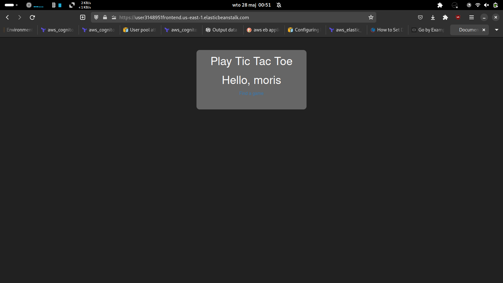

## Environment architecture

Modified frontend and backend source bundles are in their respective directories. They are zipped using the build/build.sh script. Afterwards terraform deploys them using Elastic Beanstalk. Frontend is given additional .ebextensions and hooks to setup https for it.

Cognito is setup by terraform using a hosted ui with a callback url and email verification.

In the frontend a fetch request is made to the oauth2/userInfo endpoint to get logged in username. The backend uses the same endpoint to both verify and get the username.

## Preview

Working authentication 
## Reflections

- setting up cognito in terraform was challenging with a lot of configuration settings, however in the end passing the generated clientID and domain over to eb containers was not that difficult as they are exported attributes.
- https was required to use cognito with hosted UI. This was accomplished using ebextensions and hooks to alter the nginx configuration.
- cognito exposes oauth2 endpoints that can be used to verify tokens received from hosted UI. Specifically I used the userInfo endpoint to both verify and retrieve information like 'username'.
- hosted UI is very picky about callback urls. Crucially, and afaik undocumented, the url must end in a slash.
- In order for the solution to work I had to modify the following settings in firefox (in order to allow insecure websocket connection ws / wss, and allowing the self-signed certificate for frontend domain)
  - network.websocket.allowInsecureFromHTTPS	true
  - certificate exception
